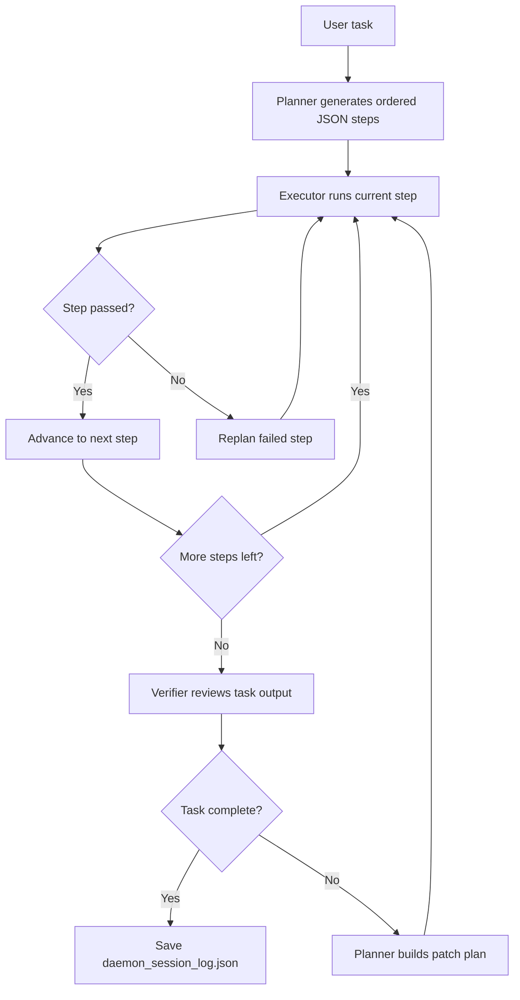

# Daemon

Daemon is a local AI agent orchestrator built in pure Python. It takes a high-level task, asks Groq for a dependency-aware plan, executes each step inside a guarded workspace, verifies the output, and loops until the work is complete or retry limits are reached.

## What It Does

- Generates structured plans from a single task prompt
- Executes file, directory, shell, and verification steps
- Replans failed steps and creates patch plans after QA failures
- Provides both a Rich CLI view and a local web dashboard
- Keeps all generated output inside the workspace sandbox

## Setup

1. Create and activate a Python 3.11+ virtual environment.
2. Install the project dependencies:

```bash
pip install -r requirements.txt
```

3. Create a local `.env` file and add your Groq key:

```env
GROQ_API_KEY=your_key_here
```

## Run The Project

CLI mode:

```bash
python main.py --task "create a python CRUD REST API using FastAPI and SQLite with 4 endpoints"
python main.py --task "build a React todo app with filters local storage and responsive layout" --workspace ./my-projects/todo
python main.py --task "scaffold a command line markdown notes app with search export and tests" --dry-run
```

Dashboard mode:

```bash
python main.py --dashboard
python main.py --dashboard --dashboard-port 8090
```

Run the regression suite:

```bash
.venv\Scripts\python.exe -m unittest discover -s tests -v
```

## Workflow



## Agent Phases

1. Planning  
   Groq returns an ordered JSON plan with concrete implementation steps.

2. Execution  
   The executor creates directories, writes files, runs commands, and attempts limited command auto-fixes.

3. Verification  
   Step-level checks run during execution, and final QA-style verification checks whether the task is truly complete.

4. Recovery  
   Failed steps can be replanned, and final verification issues can produce a patch plan for another execution pass.

5. Logging  
   The final state is written to `daemon_session_log.json` inside the workspace.

## Reorganized Project Structure

The project is organized into five main layers:

- Entry and config: CLI startup, environment loading, runtime defaults
- Agent layer: planning, execution, verification
- Core orchestration: state, Groq client, run loop
- Tooling layer: safe file and shell operations
- Presentation layer: Rich terminal UI and FastAPI dashboard

```text
Daemon/
|-- main.py
|-- config.py
|-- requirements.txt
|-- README.md
|-- .gitignore
|-- .env                  # local only, not for commits
|-- agents/
|   |-- __init__.py
|   |-- planner.py
|   |-- executor.py
|   `-- verifier.py
|-- core/
|   |-- __init__.py
|   |-- state.py
|   |-- groq_client.py
|   `-- loop.py
|-- tools/
|   |-- __init__.py
|   |-- file_tools.py
|   `-- shell_tools.py
|-- ui/
|   |-- __init__.py
|   `-- display.py
|-- dashboard/
|   |-- __init__.py
|   |-- app.py
|   |-- manager.py
|   `-- static/
|       |-- index.html
|       |-- styles.css
|       `-- app.js
`-- workspace/            # generated output, runtime logs, created projects
```

## Dashboard Features

- Start normal runs and dry runs from the browser
- Track live progress, retries, and step status
- Cancel active runs
- Inspect generated projects and files
- Launch supported generated apps and open docs links

## Safety Notes

- File writes are guarded so paths cannot escape the workspace directory.
- The planner and executor normalize unsafe or overly interactive commands when possible.
- Very short tasks are rejected so the planner gets enough detail to build a useful plan.
- Generated runtime artifacts such as databases, logs, and workspaces should stay out of version control.

## Tech Stack

- Python 3.11+
- Groq SDK
- Rich
- Pydantic
- python-dotenv
- FastAPI + Uvicorn for the local dashboard
